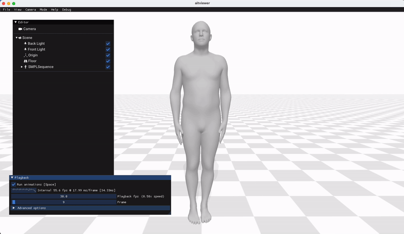
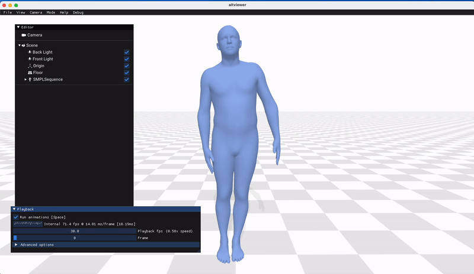

## Human pose reconstruction from IMUs over 5G-OFDM neural receiver

### 1. Dependency
Install `numpy`, `matplotlib`, `tensorflow`, `sionna`, `sionna-vispy`, `torch`, `smplx`, `scikit-learn`, `aitviewer`, `chumpy`:

```
pip install -r requirements.txt
```

### 2. Creating datasets

#### 2.1. Channel dataset
To create channel dataset with `sionna` ray tracing, run the command

```
python main.py --gen_data 1
```
This command creates two datasets of channel impulse responses of two scenes in
`sionna` that are Munich and Etoile. The datasets will be saved in `data/cirdata/` folder.
Two figures of specific ray tracing scenes can also be found in `data/figures/` folder.

#### 2.2. IMU dataset
First, we need to download `DIP-IMU` dataset from [here](https://dip.is.tuebingen.mpg.de/) by selecting `Downloads` and then `DIP IMU AND OTHERS - DOWNLOAD SERVER 1  (approx. 2.5GB)`.
Let's assume we have the unzipped folder in the directory `~/datasets/DIP_IMU_and_Others/`. To change this, make sure to update the variable `imu_dataset_path` in the files `pose_generator.py`, `main.py`, and `neural-receiver.py`.

Once we have all the files in the `~/datasets/DIP_IMU_and_Others/`, run the command

```
python pose_generator.py --process 1
```
Once the command is completed, the train and test sets will be saved in `~/datasets/DIP_IMU_and_Others/processed_train.npz` and `~/datasets/DIP_IMU_and_Others/processed_test.npz`.

#### 2.3. SMPL dataset
To download SMPL dataset, following the instruction [here](https://smpl.is.tue.mpg.de/). First, go to `Downloads` and click `Download version 1.1.0 for Python 2.7 (female/male/neutral, 300 shape PCs)`.

Assume that we have the unzipped folder in `~/datasets/SMPLs/models/`. 

To use the `aitviewer` tool for animation, we need a SMPL (.pkl file) model in `~/datasets/SMPLs/models/smpl/SMPL_MALE.pkl`, in which `SMPL_MALE.pkl` is the SMPL model
used for animation. 

For this, let's copy and rename file from `~/datasets/SMPLs/models/smpl/models/basicmodel_m_lbs_10_207_0_v1.1.0.pkl` to `~/datasets/SMPLs/models/smpl/SMPL_MALE.pkl`.

### 3. Training neural receiver
Run the following commands to train the neural receiver in 100000 iterations from scratch:
```
python main.py --eval_mode 0 --train --num_ep 100000 --scenario 2p
```
```
python main.py --eval_mode 0 --train --num_ep 100000 --scenario 1p
```
where `--scenario 2p` and `--scenario 1p` are for two scenarios of different pilot configuration, as described in the paper.

The trained models will be saved in `data/weights/`.

### 4. Evaluating trained models
To obtain BER plot, run:
```
python main.py --eval_mode 2
```
The BER plot will be saved in `data/figures` and the BER numpy file will be saved in `data/pltdata/`.

To obtain MSE plot, run:
```
python main.py --eval_mode 3
```
The MSE plot and numpy file will be saved in similar folders. 

Note that the MSE simulation also return many `npy` files in `data/imu`, such as `rec_imu_neural-receiver_7_5.0.npy`. These files will be used for later animation.

To redraw the BER and MSE plots, run:
```
python main.py --plot ber
```
```
python main.py --plot mse
```

### 5. Animation 
After obtaining `npy` files after MSE simulation, body movements can be visualized by using [aitviewer](https://github.com/eth-ait/aitviewer) tool.

But first, we need to train an IMU receiver to convert the received IMU signal into the specific pose parameter. The pose parameter is then used as input of the SMPL model to return a set of vertices in 3D.

To train the IMU receiver, run:
```
python pose_generator.py --train 1 --num_ep 50 --batch 100
```
After training the IMU receiver for 50 epochs, the trained model will be saved in `data/weights/`.

To visualize the body poses with 6-bit quatization at Eb/N0 = 5.0 dB, run:
```
python pose_generator.py --train 0 --quantz 6 --ebno 5.0
```

We can change `--quantz` and `--ebno` parameters to obtain other results shown in the paper, for example:
```
python pose_generator.py --train 0 --quantz 6 --ebno -3.0
```

Results:

 - Ground truth:



 - Neural receiver (1P) at Eb/N0 = 5 dB:

 

  - Neural receiver (1P) at Eb/N0 = -3 dB:
  
 

 