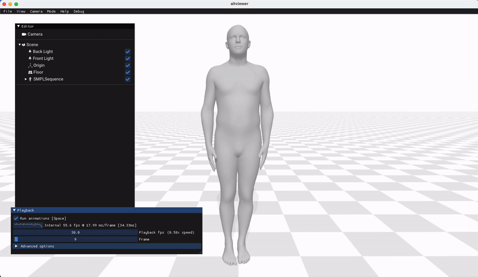
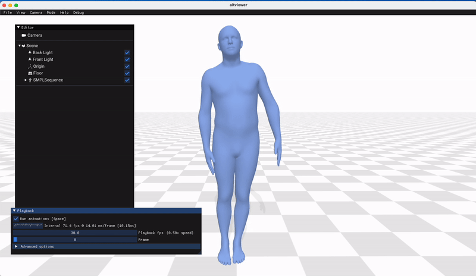

## End-to-End Human Pose Reconstruction from Wearable Sensors for 6G Extended Reality Systems

This is the source code for the paper "End-to-End Human Pose Reconstruction from Wearable Sensors for 6G Extended Reality Systems".

Authors: N. Q. Hieu, D. T. Hoang, D. N. Nguyen, M. A. Alsheikh, C. C. N. Kuhn, Y. F. Alem, and I. Radwan.

Arxiv: https://arxiv.org/abs/2503.04860

The sections below walk through the full pipeline in the order needed to reproduce the results in the paper: install dependencies, build the three datasets, train the neural receiver, run the evaluations, and reconstruct the poses. Each step lists the exact command with example parameters. A command-to-figure reference is given at the end.

### 1. Dependencies

Using Python 3.9, create and activate a virtual environment, then install the requirements:

```bash
python3 -m venv .venv
source .venv/bin/activate
pip install -r requirements.txt
```

### 2. Preparing the datasets

Three datasets are required: the ray-traced wireless channel, the DIP-IMU motion data, and the SMPL body model.

#### 2.1. Channel dataset

Generate the channel impulse responses with `sionna` ray tracing:

```bash
python main.py --gen_data 1
```

This builds two datasets of channel impulse responses for the Munich and Etoile scenes and saves them in `data/cirdata/`. Rendered images of the two scenes are written to `data/figures/`.

#### 2.2. IMU dataset

Download the `DIP-IMU` dataset from https://dip.is.tuebingen.mpg.de/ by selecting `Downloads` and then `DIP IMU AND OTHERS - DOWNLOAD SERVER 1 (approx. 2.5GB)`.

Assume the unzipped folder is at `~/datasets/DIP_IMU_and_Others/`. To use a different path, update the variable `imu_dataset_path` in `pose_generator.py`, `main.py`, and `neural_receiver.py`.

Then pre-process the raw recordings into train and test splits:

```bash
python pose_generator.py --process 1
```

This saves `~/datasets/DIP_IMU_and_Others/processed_train.npz` and `processed_test.npz`.

#### 2.3. SMPL dataset

Download the SMPL model from https://smpl.is.tue.mpg.de/ by selecting `Downloads` and then `Download version 1.1.0 for Python 2.7 (female/male/neutral, 300 shape PCs)`.

Assume the unzipped folder is at `~/datasets/SMPLs/models/`. The animation step needs a male SMPL `.pkl` at `~/datasets/SMPLs/models/smpl/SMPL_MALE.pkl`. Copy and rename it from the downloaded model:

```bash
cp ~/datasets/SMPLs/models/smpl/models/basicmodel_m_lbs_10_207_0_v1.1.0.pkl \
   ~/datasets/SMPLs/models/smpl/SMPL_MALE.pkl
```

### 3. Training the neural receiver

Train the neural receiver from scratch (100000 iterations) for each pilot configuration. `--scenario 2p` uses two pilot slots and `--scenario 1p` uses one, matching the two configurations in the paper:

```bash
python main.py --eval_mode 0 --num_ep 100000 --scenario 2p
python main.py --eval_mode 0 --num_ep 100000 --scenario 1p
```

To train the fully-connected (FC) receiver baseline instead of the residual-convolutional one, add `--receiver neural-receiver-fc`:

```bash
python main.py --eval_mode 0 --num_ep 100000 --scenario 2p --receiver neural-receiver-fc
```

Trained models are saved in `data/weights/`. Use `--eval_mode 1` to resume training from a checkpoint.

### 4. Evaluating the trained models

The default channel is `--channel raytracing`; the same commands produce the CDL-A and AWGN results by passing `--channel cdl` or `--channel awgn`.

**Bit error rate (BER).** Run the BER simulation, which sweeps `Eb/N0` from -5 to 15 dB:

```bash
python main.py --eval_mode 2                 # ray tracing  -> Fig. 6
python main.py --eval_mode 2 --channel cdl   # CDL-A        -> Fig. 7
```

The figure is saved in `data/figures/` and the raw values in `data/pltdata/bler_<channel>.npy`.

**Reconstruction MSE.** Run the MSE simulation over the quantization sweep (4 to 10 bits) at `Eb/N0 = 5 dB`:

```bash
python main.py --eval_mode 3                 # ray tracing  -> Fig. 8
python main.py --eval_mode 3 --channel cdl
python main.py --eval_mode 3 --channel awgn
```

This also writes per-signal `npy` files to `data/imu/` (for example `rec_imu_neural-receiver_7_5.0.npy`) that are reused for pose reconstruction and animation.

**Cross-channel and split-panel figures.** After the per-channel `npy` files exist, redraw the paper's multi-channel and 2P/1P split figures with the standalone plotting script:

```bash
python plot_comparisons.py ber_cdl        # CDL-A BER, split into 2P | 1P  -> Fig. 7
python plot_comparisons.py mse_channels   # MSE across channels, 2 panels  -> Fig. 9
```

**Per-scene BER.** To evaluate BER separately on the Munich and Etoile scenes:

```bash
python main.py --eval_mode 4
python plot_comparisons.py per_scene
```

### 5. Pose reconstruction and MPJAE

The received IMU signals are decoded into SMPL pose parameters by a small IMU receiver, then evaluated with the Mean Per Joint Angular Error (MPJAE).

Train the IMU receiver (MLP) on the clean DIP-IMU sequences:

```bash
python pose_generator.py --train 1 --num_ep 50 --batch 100
```

The model is saved in `data/weights/`. With it in place, run the MPJAE simulation over the quantization sweep:

```bash
python pose_generator.py --train 0 --jae_sim 1                    # -> Fig. 12
```

Use `--reference gt` (default) for the absolute error against ground-truth poses, or `--reference clean` for the relative error against the clean-input prediction.

**Temporal baselines (LSTM / Bi-RNN).** Train the two temporal receivers, then compare all three networks on identical distorted signals:

```bash
python temporal_receivers.py --train bi_rnn --num_ep 50
python temporal_receivers.py --train lstm   --num_ep 50
python temporal_receivers.py --compare 1 --ebno 5.0              # -> Fig. 13
```

This produces one `(a) 2P | (b) 1P` figure per receiver in `data/figures/`.

### 6. Redrawing figures

Once the `npy` result files exist, the figures can be redrawn without rerunning the simulations:

```bash
python main.py --plot ber      # Fig. 6
python main.py --plot mse      # Fig. 8
python main.py --plot mpjae    # Fig. 12
```

All figures share a single style defined in `plot_style.py` (consistent font sizes, no titles, one line style per method). Edit that file to restyle every figure at once.

### 7. Animation

Body movements can be visualized with the [aitviewer](https://github.com/eth-ait/aitviewer) tool using the `npy` files produced by the MSE simulation. To render the poses at 6-bit quantization and `Eb/N0 = 5 dB`:

```bash
python pose_generator.py --train 0 --quantz 6 --ebno 5.0 --animate 1
```

Change `--quantz` and `--ebno` for other operating points, for example a harsher channel at `Eb/N0 = -3 dB`:

```bash
python pose_generator.py --train 0 --quantz 6 --ebno -3.0 --animate 1
```

### 8. Command-to-figure reference

| Paper figure | Command |
| --- | --- |
| Fig. 6  — BER vs Eb/N0 (ray tracing) | `python main.py --eval_mode 2` |
| Fig. 7  — BER vs Eb/N0 (CDL-A) | `python main.py --eval_mode 2 --channel cdl` then `python plot_comparisons.py ber_cdl` |
| Fig. 8  — Reconstruction MSE vs quantization | `python main.py --eval_mode 3` |
| Fig. 9  — MSE vs quantization across channels | `python main.py --eval_mode 3 --channel {raytracing,cdl,awgn}` then `python plot_comparisons.py mse_channels` |
| Fig. 12 — MPJAE vs quantization | `python pose_generator.py --train 0 --jae_sim 1` |
| Fig. 13 — MPJAE for MLP / LSTM / Bi-RNN | `python temporal_receivers.py --compare 1 --ebno 5.0` |

### Results

- Ground truth:



- Neural receiver (1P) at Eb/N0 = 5 dB:


- Neural receiver (1P) at Eb/N0 = -3 dB:


